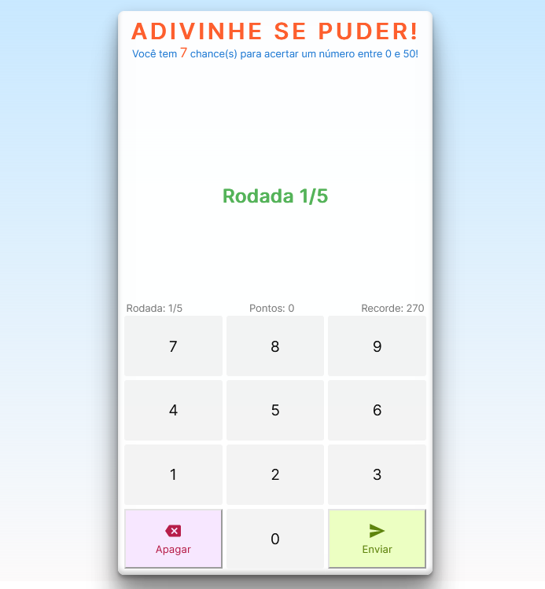

<h1 align="left">Adivinhe se puder!</h1>

<h2>Tecnologias</h2>

Esse projeto foi desenvolvido com as seguintes tecnologias:

<ul>
    <li>HTML</li>
    <li>CSS</li>
    <li>JavaScript</li>
</ul>
<h2>Projeto</h2>

Trata-se de um game onde o jogador tem cinco chances para adivinhar um número entre 0 e 100. Esse joguinho foi adaptado para minha sobrinha querida, Júlia!

Exercício básico de programação (desafio), transformado em game. Aproveitei para exercitar a exploração do HTML DOM, através do javascript, desenvolvendo as funções necessárias para que o programa pudesse rodar sem a necessidade de um  formulário de entrada: script para detecção de teclas, quando utilizado no PC ou Notebook; armazenamento de dados no Local Storage para a gravação do recorde de pontos; além do CSS necessário para deixar o desafio no formato "calculadora".

Link para o game:<a href="https://mfeduardo.github.io/adivinhe-se-puder/" target="_blank"> https://mfeduardo.github.io/adivinhe-se-puder/</a>

